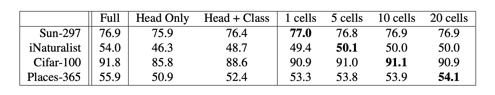

# [Fine-tuning Image Transformers using Learnable Memory](https://arxiv.org/abs/2203.15243)

This README file is an outcome of the [CENG502 (Spring 2023)](https://ceng.metu.edu.tr/~skalkan/ADL/) project for reproducing a paper without an implementation. See [CENG502 (Spring 20223) Project List](https://github.com/CENG502-Projects/CENG502-Spring2023) for a complete list of all paper reproduction projects.

# 1. Introduction

<!-- @TODO: Introduce the paper (inc. where it is published) and describe your goal (reproducibility). -->

[Fine-tuning Image Transformers using Learnable Memory](https://arxiv.org/abs/2203.15243) is a paper published in [CVPR 2022](https://openaccess.thecvf.com/content/CVPR2022/html/Sandler_Fine-Tuning_Image_Transformers_Using_Learnable_Memory_CVPR_2022_paper.html).
The proposed method introduces learnable memory tokens in each self-attention layer of Vision Transformer models, enabling non-destructive fine-tuning and preserving performance on previous tasks while adapting to new ones.

In this repository, we implement this paper in PyTorch and aim to reproduce the results with our limited computational resources.
- The main implementation in [`vit.py`](vit.py) is based on the ViT implementation in HuggingFace Transformers library.
  - Unit tests are available in [`test_vit.py`](test_vit.py). Run them using `pytest`.
- In [the mnist directory](./mnist), there's a minimal ViT implementation in PyTorch from scratch with support for learnable memory tokens.
  - This implementation is simpler and may be easier to understand.

## 1.1. Paper summary

<!-- @TODO: Summarize the paper, the method & its contributions in relation with the existing literature. -->

The main idea in the proposed method is to introduce learnable memory tokens in each self-attention layer.
These tokens don't attend to other tokens and they are discarded after the self-attention, but the other tokens attend to these tokens.
Furthermore, the performance of the model on the previous dataset is preserved thanks to the proposed attention masking strategy.
Thus, this method increases the capacity of a pre-trained model in a non-destructive manner while avoiding the catastrophic forgetting problem that plagues the fine-tuning approaches.
Finally, the attention masking allows us to concatenate separately fine-tuned models into a single model which enables the reuse of computation while running these models.

# 2. The method and our interpretation

## 2.1. The original method

### 2.1.1. Memory tokens

<p align="center"></p>
<p align="center"><i>Figure 1. Memory tokens are concatenated to the input before each encoder layer. (Borrowed from the paper.)</i></p>

The method builds on top of a regular transformer encoder layer.
First, let's remember the input to a visual transformer (ViT):

```math
\mathbf{z}^{vit}_0 := [x_{\texttt{cls}}, E x_1, \dots,E x_{N}] + E_{pos}
```

This equation incorporates flattened image patches, denoted as $x_1 \dots x_N$, that undergo processing through a learnable linear transformation $E$. The class token, represented by $x_{\texttt{cls}}$, serves as a unique learnable token shared across inputs, with its output value serving as the embedding for final classification. Additionally, the equation includes the position embedding $E_{pos}$.

In order to enhance the transformer with memory, we introduce $m$ learnable memory embeddings $E_{mem} \in \mathbb{R}^{m \times D}$ where $D$ represents the dimensionality of the input tokens.
These tokens are concatenated to the input as follows:

```math
\mathbf{z}^{mem}_0 := [\mathbf{z}^{vit}_0; E^0_{mem}]
```

As a result, the transformer now receives a total of $N + 1 + m$ tokens.
Subsequently, this input is passed through the transformer encoder layer, maintaining the same architecture as ViT.
However, an important distinction is that the updated memory is not propagated, i.e., the output of the self-attention module is truncated to include only the first $N+1$ tokens .
Hence, the output of layer $l$, denoted as $\mathbf{y}_l$, consists of solely $N+1$ tokens which correspond to the class token and the image patches.

The memory is incorporated to the subsequent layers similarly.
Given the truncated output of the previous layer $\mathbf{y}_{l-1}$, the input to the layer $l$ is:

```math
\mathbf{z}^{mem}_l = [\mathbf{y}_{l-1}; E^l_{mem}]
```

This process is illustrated in the following figure.

<p align="center"></p>
<p align="center"><i>Figure 2a. Demonstration of how the encoder layer is modified to implement memory. (Borrowed from the paper.)</i></p>

Each memory token is randomly initialized with samples drawn from a normal distribution with a mean of 0 and a standard deviation of 0.02.

### 2.1.2. Alternative ways of introducing memory

[The previous work in this field](https://arxiv.org/abs/2006.11527) opted for propagating the memory after the self-attention layer instead of discarding it.
Another alternative is to propagate the memory and update it additively at each encoder layer.
However, the authors found that propagating memory in any of these ways performs worse than the method proposed in the paper, i.e., concatenating different memory tokens in each layer and discarding them.

<p align="center"></p>
<p align="center"><i>Figure 2b. Demonstration of alternative ways to implement memory. (Borrowed from the paper.)</i></p>

Note that these approaches were not implemented in this repository since they are not introduced by this paper.


### 2.1.3. Attention masking

If we fine-tune a pre-trained transformer model's class token on a new dataset or add memory, there is typically a decrease in performance on the original task.
A popular way to address this problem is multi-task learning, which carries out the learning process on all datasets simultaneously.
However, this approach is not always feasible due to practical constraints such as data ownership by separate entities.

To overcome this limitation, the authors propose the following **non-destructive fine-tuning method**:
1. A new class token and a new per-task head is introduced alongside the memory.
2. These newly added parameters are fine-tuned without modifying the original model parameters.
3. An attention masking strategy is employed in the self-attention layers, which causes the original class token to remain the same even after the addition of new parameters and fine-tuning.

Thus, the fine-tuned model produces two outputs simultaneously: one for the original dataset (on which the model was pre-trained) and one for the new dataset (on which the model was fine-tuned).
The output for the original dataset is identical to the output from the unmodified pre-trained model.
Therefore, this approach allows the reuse of not only parameters but also the computation since the fine-tuned model effectively emulates two models at the same time.

Furthermore, it is possible to concatenate multiple models that are based on the same pre-trained model but fine-tuned separately on different datasets.
The output of the concatenated model will contain the output of each fine-tuned model.
This enables massive computation reuse at inference time since we only need to run one concatenated model instead of many fine-tuned models.
Model concatenation process is depicted in the following figure.

<p align="center"></p>
<p align="center"><i>Figure 3. Concatenation of separately fine-tuned models. (Borrowed from the paper.)</i></p>

The attention masking works by preventing the original model tokens from attending to the newly added tokens, thereby preserving the original model outputs.
However, the new class token can freely attend to the old tokens.
Note that the memory tokens don't attend to any other token since they are not passed on to the following layers.
See the table below for more information.

<p align="center"></p>
<p align="center"><i>Table 1. Token interactions in attention masking. (Borrowed from the paper.)</i></p>

If the goal is to fine-tune an already fine-tuned model on another dataset, there are two different ways to implement the attention masking:
1. **Model concatenation:** We can disallow interactions between the tokens added in the first fine-tuning and the second fine-tuning. This is equivalent to fine-tuning two models separately and concatenating them.
2. **Model extension:** The tokens added in the second fine-tuning can attend to the tokens from the first fine-tuning (but not vice-versa since that would affect the output of the first fine-tuning).


## 2.2. Our interpretation 

We believe that our implementation is consistent with the method described in the paper, since the method is clearly explained and not much is left to interpretation.
This section will go into minor implementation details that were not given in the paper (rightly so, since too much detail can harm the brevity) and how we handled them.

## 2.2.1. Background

First, recall [how a self-attention layer works](https://arxiv.org/abs/1706.03762).
Initially, we compute the $q$, $k$, $v$ (query, key, value) vectors by applying three separate linear projections to the input $z$:

```math
q = Q z
```
```math
k = K z
```
```math
v = V z
```

An optional bias term can be added to these equations, which is omitted for brevity.

After that, the scaled dot-product attention is applied:

```math
\mathrm{Attention}(q, k, v) = \mathrm{softmax}(\frac{qk^T}{\sqrt{d_k}})v
```

where $\frac{1}{\sqrt{d_k}}$ is the scaling factor.

## 2.2.2. Attention masking

By default, the vision transformer in HuggingFace library concatenates the class token to the beginning.
We modified it so that the class tokens are appended to the end, and the memory tokens come after them.
With this modification, the attention mask becomes identical to the matrix given in Table 1.

We apply the masking before the softmax function.
Because if we apply masking after softmax by multiplying certain elements with 0, the attention scores will not add up to 1.
Since the softmax operation exponentiates the inputs, the mask should be incorporated to the input using addition instead of multiplication.
Therefore, the masked elements will have a value of `-inf` (which maps to 0 after exponentiation) and the rest will be 0, the additive identity.

`build_attention_mask` in [`vit.py`](vit.py) constructs the attention mask given in Table 1, which is then added to the input of the softmax in the self-attention layer:

```math
\mathrm{Attention}(q, k, v) = \mathrm{softmax}(\frac{qk^T}{\sqrt{d_k}} + \mathrm{mask})v
```

Also note that memory tokens are not given in Table 1, since they don't attend to any other token.
However, if we attempt to mask them as we did in the previous equation, all elements in one row of the attention mask will be `-inf`, which will cause a division by zero error in the softmax.

To fix this, we simply don't concatenate the memory tokens while calculating the queries $q$.
For the given input $z$, $z_{mem}$ is the input concatenated with the memory tokens $E_{mem}$ for this layer:

```math
z_{mem} :=  [z; E_{mem}]
```

Then, $q$, $k$, $v$ vectors are computed as follows:

```math
q = Q z
```
```math
k = K z_{mem}
```
```math
v = V z_{mem}
```

With this change, the outer dot product $qk^T$ will yield a matrix that is exactly the same shape as the attention mask given in Table 1.
Thanks to this, the matrix constructed by `build_attention_mask` in [`vit.py`](vit.py) is exactly the same as Table 1 in terms of columns and rows: memory tokens are not present in the query rows.

Furthermore, the matrix multiplication of attention scores (softmax output) and $v$ will naturally remove the memory tokens from the output since $q$ doesn't contain the memory tokens.
Thus, we don't need to do any additional truncation operation.

These are implemented the `forward` method of `SelfAttentionWithMemory`.


# 3. Experiments and results

## 3.1. Experimental setup

In this section, we will provide information about the base model, the datasets, and the training process.

### 3.1.1. Base model

In the paper, the authors use ViT-B/32 base transformer model pre-trained on ImageNet-21K.
This is the case for all experiments, with the only exception being the experiment in which they compare different ViT architectures: ViT-B/32, ViT-B/16, and ViT-L/32.
We didn't aim to reproduce that particular experiment due to our limited resources; we focused on fine-tuning ViT-B/32.
Consequently, we used [this ViT-B/32 model pre-trained on ImageNet-21K](https://huggingface.co/google/vit-base-patch32-224-in21k) from HuggingFace.

### 3.1.2. Datasets

In the paper, the experiments were conducted on 4 distinct datasets: CIFAR-100, i-Naturalist, Places-365, and SUN-397.
The performance metric in these experiments was the accuracy of the models on the respective validation sets.
These 4 datasets can be easily found on the internet, and are also available in PyTorch's dataset module.

However, the paper lacks specific implementation details regarding some of these datasets.
For example, it does not explain how the i-Naturalist and SUN-397 datasets were split into training and validation sets.
To address this, we randomly split these datasets with an 80-20 ratio to create the training and validation sets.
Moreover, there are multiple versions of the Places-365 and i-Naturalist datasets in the PyTorch dataset package, but the paper does not specify which versions were used.
For our experiments, we utilized the standard version of the Places-365 dataset and the 2017 version of the i-Naturalist dataset.

### 3.1.3. Training

For all fine-tuning experiments in the paper, the authors used SGD with Momentum, along with gradient clipping and a 5-step linear rate warmup.
We followed the same hyperparameters and settings in our experiments.
The paper adopted standard inception preprocessing for all datasets except for CIFAR-100, where random clipping was used.
We also followed these preprocessing steps for consistency.
Similarly, we initialized the memory tokens from the distribution of $\mathcal{N}(0, 0.02)$, as described in the paper.

There are some differences between our experimentation setup and the paper's setup in terms of batch size and the number of fine-tuning steps.
The paper used a batch size of 512 and ran for 20000 steps.
Because of memory limitations, we had to use a batch size of 64, which would require us to train for 160000 steps in order to process the same amount of samples.
However, due to limited resources and time constraints, we had to reduce the number of fine-tuning steps as well: 15640 steps for CIFAR-100, 84400 steps for i-Naturalist, 13600 steps for SUN-397, and 84560 steps for Places-365.
Although our numbers of steps are significantly smaller, please note that the datasets are huge.
For instance, a single epoch on the Places-365 dataset (which constitutes 28180 steps when the batch size is 64) took over 13 hours.
Nevertheless, the paper mentioned that shorter runs generally yielded slightly worse results while preserving the relative relationships, and our results are comparable to those reported in the paper.

In our experiments, we only tested 1 cell memory token for all datasets and compared the results with the paper's findings using the same configuration.
The paper also discussed full fine-tuning and head+class token fine-tuning, but we did not include them in our implementation as they are not the main contributions of the paper.
However, you can explore these types of fine-tuning options in our sample notebook.


## 3.2. Running the code

```
Directory structure:
	├── models *
	│   ├── CIFAR100_model.pt
	│   ├── Places_model.pt
	│   ├── INaturalist_model.pt
	│   └── Sun_model.pt
	├── images
	├── mnist
	├── download_models.sh *
	├── vit_train.py *
	├── vit_validation.py *
	├── vit.py *
	├── vit.ipynb ~
	├── large-vit.ipynb ~
	├── model_concatenate.ipynb ~
	└── requirements.txt *

Dataset Directory Structure:
	├── ceng502
	│   └── models--google--vit-base-patch32-224-in21k
	│
	└── datasets
```
- Folders and files with * on their right are the folders and files that should be downloaded.
- Files with ~ on their right are the notebooks for the examination of the implementation. 
- models directory and the models that we have trained should be downloaded via following the steps at the [section 3.2.1](#downloading-the-models)
- Dataset Directory is created on a given directory which should be declared as an argument while training or validation phase. We have created this directory at our HDD because the datasets are huge. The datasets will be downloaded if the code cannot find them at the given directory.
- models directory contains finetuned learnable memory models for each dataset, and you have to download them if you want to directly use the finetuned model without waiting for training.
- vit_train.py is the script for training and there are some arguments should be given.
- vit_validation.py is the script for validation and there are some arguments should be given.
- vit.py is the script for the memory token model which is essential part of our implementation.
- requirements.txt should be downloaded and the packages should be installed before running the scripts. You can install the required packages by the given command.

```bash
  pip install -r requirements.txt
```
- Training:
To train memory tokens for a given dataset, you have to execute vit_train.py script with arguments. 
The usage is like this:
```
python3 vit_train.py --dataset {CIFAR100/INaturalist/Places/Sun} --directory {directory_for_datasets} --epochs {number_of_epochs} --batch_size {number_of_batch_size} --number_of_memory_tokens {number_of_memory_tokens}
```

```dataset``` is the option for dataset, ```directory``` is the option for where you want to download the datasets which are huge, so keep in mind that. ```epochs```, ```batch_size``` and ```number_of_memory_tokens``` are the options for hyperparameters.

- Validation:
To validate your model with different datasets, you have to execute vit_validation.py script with arguments.
The usage is like this:
```
python3 vit_validation.py --models_list {CIFAR100/INaturalist/Places/Sun} --directory {directory_for_datasets} --batch_size {number_of_batch_size} --number_of_memory_tokens {number_of_memory_tokens}
```
```models_list``` is the option for list of models, you can give all 4 models as ```CIFAR100 INaturalist Places Sun```. For example, if you want to validate the model which concatenate all 4 memory tokens at once, you have to run the below command.

```
python3 vit_validation.py --models_list CIFAR100 INaturalist Places Sun
```
```directory``` is the option for where you want to download or already downloaded the datasets. ```batch_size``` and ```number_of_memory_tokens``` are the options for hyperparameters, but keep in mind that number_of_memory_tokens should be same with the model training value.

<a name="downloading-the-models"></a>
### 3.2.1. Downloading the models

The models we trained are available on [this HuggingFace repository](https://huggingface.co/necrashter/transformers-learnable-memory).
Since these models have a large file size, we didn't include them here.
However, we supply [a Bash script](./download_models.sh) for easily downloading the models from HuggingFace.

Run the script using
```bash
./download_models.sh
```
If that doesn't work, try:
```bash
bash ./download_models.sh
```

This script requires the `wget` utility, which is preinstalled by default on many Linux distributions.

## 3.3. Results

As we stated the datasets are tremendous, so we could not conduct experiments for every experiments that the paper has implemented. We only tried 1 memory cell (token) model for the 4 datasets. In addition to that, as we stated we have faced some resource problems in terms of time and memory constraints. Moreover, some datasets do not have train and validation partitions and the paper did not share their splitting logic, so we just randomly splitted the dataset.
Even though there are some limitations as we stated, we still get comparable results with the paper implementation. In addition to that, we even get better accuracy for SUN-397 and i-Naturalist datasets which do not have train and validation set by default, so one of the reason why we get better accuracy is the randomly split of the datasets. The accuracy values of the paper can be seen below.
<p align="center"></p>
<p align="center"><i>Table 2. Accuracy for different datasets for each fine-tuning regime of the paper (Borrowed from the paper.)</i></p>

We only compare the results with the column 1 cells which is the result for finetuning 1 memory token models.
However, anyone can conduct experiments with different number of memory cells by giving it as an argument to training and validation scripts.
The our implementation accuracy values can be seen in the below table.
<p align="center">
<table>
  <tr>
    <th>Dataset</th>
    <th>Validation Result</th>
  </tr>
  <tr>
  	<td>SUN-397</td>
    <td>80.96</td>
  </tr>
  <tr>
  	<td>iNaturalist</td>
    <td>58.70</td>
  </tr>
  <tr>
  	<td>CIFAR-100</td>
    <td>64.08</td>
  </tr>
  <tr>
    <td>Places-365</td>
    <td>50.47</td>
  </tr>
</table>
<i>Table 3. Validation results for different datasets from our implementation.</i>
</p>

As we can easily see, we have similar results with the results of the paper implementation. Only CIFAR-100 dataset has significantly worse result than paper. The reasons that we thought are the number of steps we chose and relatively small dataset. We only trained for 15640 steps because of the time constraints, so 15640 steps may be a little bit small number.

An important side note is in our script we do not multiply accuracy values with 100, so you will see floating point numbers for the accuracy values. You have to multiply these values with 100 to get accuracy percentage.


# 4. Conclusion

The method that the paper proposed integrated learnable memory tokens into each self-attention layer, presenting a novel approach to model fine-tuning. Moreover, the attention masking strategy ensured that the model's performance on previous datasets remained unaffected. In our implementation, we could not conduct every experiment that the paper has examined because of time constraints, but we were able to get comparable results with 1 memory token even though we have used smaller number of steps for datasets. Moreover, we only conduct experiments for 1 memory cell but anyone who uses our implementation can conduct experiments with the number of memory tokens as his/her wish by giving as an argument to the scripts. We did not fully reproduce the results as we have used different number of batch sizes, random splits over some datasets and randomness of the memory token initializations, but the results showed that we can achieve the fin-etuning memory token benefits in our implementation.

# 5. References

- Sandler, M., Zhmoginov, A., Vladymyrov, M., & Jackson, A. (2022, March 30). [**Fine-tuning image transformers using learnable memory.**](https://arxiv.org/abs/2203.15243) arXiv.org. https://arxiv.org/abs/2203.15243
- Vaswani, A., Shazeer, N., Parmar, N., Uszkoreit, J., Jones, L., Gomez, A. N., Kaiser, L., & Polosukhin, I. (2017, December 6). [**Attention is all you need.**](https://arxiv.org/abs/1706.03762) arXiv.org. https://arxiv.org/abs/1706.03762
- Dosovitskiy, A., Beyer, L., Kolesnikov, A., Weissenborn, D., Zhai, X., Unterthiner, T., Dehghani, M., Minderer, M., Heigold, G., Gelly, S., Uszkoreit, J., & Houlsby, N. (2021, June 3). [**An image is worth 16x16 words: Transformers for image recognition at scale.**](https://arxiv.org/abs/2010.11929) arXiv.org. https://arxiv.org/abs/2010.11929
- Burtsev, M. S., Kuratov, Y., Peganov, A., & Sapunov, G. V. (2021, February 16). [**Memory transformer.**](https://arxiv.org/abs/2006.11527) arXiv.org. https://arxiv.org/abs/2006.11527
- Szegedy, C., Liu, W., Jia, Y., Sermanet, P., Reed, S., Anguelov, D., Erhan, D., Vanhoucke, V., & Rabinovich, A. (2015). [**Going deeper with convolutions.**](https://www.cv-foundation.org/openaccess/content_cvpr_2015/html/Szegedy_Going_Deeper_With_2015_CVPR_paper.html) In Proceedings of the IEEE conference on computer vision and pattern recognition (pp. 1-9).
- Krizhevsky, A., & Hinton, G. (2009). [**Learning multiple layers of features from tiny images.**](https://www.cs.toronto.edu/~kriz/learning-features-2009-TR.pdf) Technical report, University of Toronto.
- Van Horn, G., Mac Aodha, O., Song, Y., Cui, Y., Sun, C., Shepard, A., Adam, H., Perona, P., & Belongie, S. (2018, June). [**The iNaturalist species classification and detection dataset.**](https://arxiv.org/abs/1707.06642) In The IEEE Conference on Computer Vision and Pattern Recognition (CVPR).
- Zhou, B., Lapedriza, A., Khosla, A., Oliva, A., & Torralba, A. (2017). [**Places: A 10 million image database for scene recognition.**](https://arxiv.org/abs/1610.02055) IEEE transactions on pattern analysis and machine intelligence.
- Xiao, J., Hays, J., Ehinger, K. A., Oliva, A., & Torralba, A. (2010, June). [**Sun database: Large-scale scene recognition from abbey to zoo.**](https://vision.princeton.edu/projects/2010/SUN/) In CVPR (pp. 3485-3492).


# Contact

You can contact us by opening an issue in this repository, which is preferred for matters related to this implementation.
Alternatively, you can send an e-mail to us:
- İlker Işık, e238051@metu.edu.tr
- Ege Berk Büyükbaş, ege.buyukbas@metu.edu.tr

# License

All original code we wrote in this repository is licensed under [the MIT License](./LICENSE).

Everything except for the following is our original work:
- The implementation in [`vit.py`](vit.py) is based on the [ViT implementation of the HuggingFace library](https://github.com/huggingface/transformers/blob/main/src/transformers/models/vit/modeling_vit.py), which is licensed under [the Apache 2.0 License](http://www.apache.org/licenses/LICENSE-2.0). It contains our contributions as well as the base code from the HuggingFace library.
- All pictures in the [images](./images) directory are borrowed from the paper. These images belong to their copyright holders. They are provided in this repository for educational purposes only, which constitute fair use under the US copyright law.
